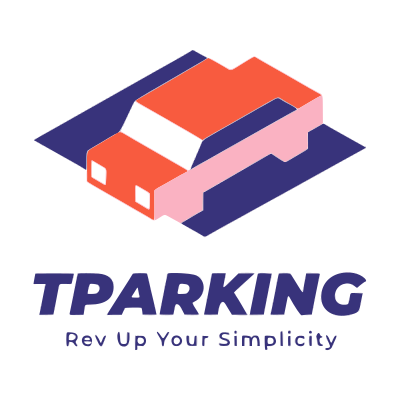

<p align="center">
  
</p>

<h1 align="center">Tparking</h1>
<p align="center"><b>Smart Car Parking Application</b></p>

<p align="center">
  <a href="https://flutter.dev"></a>
  <a href="https://firebase.google.com"></a>
  <a href="https://pub.dev/packages/get"></a>
  <a href="https://dart.dev"></a>
  <a href="https://www.tni.ac.th"></a>
</p>

<br/>

**Tparking** is an intelligent, real-time car parking reservation and management application built with **Flutter** (Dart) and backed by **Firebase**. Designed and developed as a university project for **Thai-Nichi Institute of Technology (TNI)**, the application aims to optimize parking search, dynamic slot booking, and check-in workflows on campus.

---

## 📖 Table of Contents
- [✨ Key Features](#-key-features)
- [🔒 Business Rules & Constraints](#-business-rules--constraints)
- [🛠️ Tech Stack & Architecture](#️-tech-stack--architecture)
- [📂 Project Directory Structure](#-project-directory-structure)
- [🚀 Getting Started](#-getting-started)
- [📱 Application Screens](#-application-screens)

---

## ✨ Key Features

### 1. Real-time Parking Slot Syncing
* Live status syncs for parking slots (Empty, Booked, Parked) using **Firebase Realtime Database** listeners.
* Categorized parking zones based on university buildings: **A Building**, **B Building**, and **C Building** via a dynamic dropdown selection.
* Supports visual layouts for 8 active parking slots (A-1 to A-8) displaying structural entry (ENTRY) and exit (EXIT) paths.

### 2. Geofenced GPS Check-In
* **Preventing "No-Show" Bookings:** To secure and finalize a booking, users must physically arrive at the TNI campus before they can tap the **CHECK-IN** button.
* Uses the **Location** package to query live device coordinates and calculate the distance to the TNI campus center (พิกัด Latitude: `13.7380`, Longitude: `100.6284`).
* **The Constraint:** Users must be within a **150-meter radius** (`distance <= 0.15` km) of TNI coordinates. If they are outside this boundary, the app prevents check-in and triggers a "You Didn't in TNI" alert.

### 3. Smart Countdown Timer & Notifications
* A reactive circular countdown timer (`CircularCountDownTimer`) is presented on the home dashboard to monitor reservation lifetimes (adjustable between 10 to 30 minutes during booking).
* If the reservation timer expires before the user checks in, the slot is automatically released (freeing it for others) and a local alert is triggered using **Flutter Local Notifications**.

### 4. Vehicle Registration & User Profiles
* Secure authentication (Sign-Up / Login) managed via **Firebase Authentication**.
* Local registration of vehicle license plates cached in `SharedPreferences` and dynamically loaded in the booking screen via a searchable dropdown (`DropdownSearch`).
* User profile editing, including profile picture changes via the camera or gallery (`image_picker`) uploaded seamlessly to **Firebase Storage**.

---

## 🔒 Business Rules & Constraints

To maintain order and align with university campus policies, several strict operational rules are programmed into the system:

* **Role-Based Booking Restrictions (Student vs Staff):** 
  * Users with the `Student` role are restricted from reserving parking spots **before 15:00 PM (3 PM)**. This ensures parking slots are prioritized for faculty members, teachers, and university staff during standard working hours.
* **Operating Hours Constraint:**
  * Active reservations are strictly allowed between **05:00 AM and 19:00 PM (7 PM)**.
  * Attempting to book outside these hours will prompt an error ("Please wait until 5.00 am").
  * Every slot is automatically wiped and reset (`ResetParked`) nightly to maintain an empty, pristine state for the next morning.

---

## 🛠️ Tech Stack & Architecture

Tparking leverages **Dart** and **Flutter** with a highly structured Clean Feature-First Architecture, which maximizes readability, decoupled state management, and maintenance:

* **State Management:** [GetX](https://pub.dev/packages/get) for powerful reactive state bindings, effortless view navigation, and dependency injection.
* **Database & Cloud Infrastructure:**
  * **Firebase Realtime Database:** Listens and updates parking slot occupation metrics live.
  * **Cloud Firestore:** Stores user credential details, full names, roles, and profile settings.
  * **Firebase Storage:** Uploads and hosts user profile images.
  * **Firebase Authentication:** Handles secure user authorization.
* **UI Components & Motion Design:**
  * `salomon_bottom_bar` — Modern, sleek navigation bar.
  * `lottie` — Renders high-fidelity animations for loading and success screen checkouts.
  * `circular_countdown_timer` — High-precision visual timer.
  * `animations` & `flutter_staggered_animations` — Premium, polished screen transitions.
* **Device APIs integrations:**
  * `location` — GPS polling to validate physical geofences.
  * `image_picker` — Direct camera/photo access.
  * `flutter_local_notifications` & `firebase_messaging` — Background and local notifications.

---

## 📂 Project Directory Structure

```text
tparking/
├── android/                                            # Android-specific configuration and native code
├── ios/                                                # iOS-specific configuration and native code
├── assets/                                             # Static application assets
│   ├── animation/                                      # Lottie JSON animation files (e.g., running_car.json)
│   ├── images/                                         # Graphic images, illustrations, and icons
│   └── logo/                                           # Application branding logos (Welcome_Logo.png, logo.png)
├── lib/                                                # Dart source code of the Flutter application
│   ├── firebase_options.dart                           # Firebase configuration mappings
│   ├── main.dart                                       # Application entrypoint
│   └── src/
│       ├── common_widgets/                             # Reusable global widgets and layout constants
│       │   └── constants/                              # Application-wide constants
│       │       ├── colors.dart                         # Primary & accent colors definition
│       │       ├── image_stritngs.dart                 # Asset image string references
│       │       ├── sizes.dart                          # Standardized sizing and padding tokens
│       │       └── text_string.dart                    # String constants used across views (localization-ready)
│       ├── features/                                   # Core application modules (Feature-First Architecture)
│       │   ├── authentication/                         # Register, Login, Welcome, and Splash features
│       │   │   ├── controllers/                        # GetX Controllers for auth flows
│       │   │   ├── models/                             # UserModel representation
│       │   │   └── screens/                            # Views for auth onboarding
│       │   │       └── splash_screen/
│       │   │           ├── login/                      # Login screen & layout widgets (footer, form, header)
│       │   │           ├── signup/                     # Sign-Up screen & registration widgets
│       │   │           ├── welcome/                    # Onboarding Welcome screen
│       │   │           └── splash_screen.dart          # Interactive splash view
│       │   ├── core/                                   # Post-authentication core screens and modules
│       │   │   ├── controllers/                        # Controllers for core application flow
│       │   │   └── screens/                            # Primary user dashboard views
│       │   │       ├── dashboard/                      # Main Dashboard housing navigation
│       │   │       ├── forget_password/                # Forgot password mail and recovery screens
│       │   │       ├── profiles/                       # Profile settings and update forms
│       │   │       ├── reserves/                       # Real-time slot booking and list views
│       │   │       │   ├── booking_page.dart           # Slot selection slider & reservation form
│       │   │       │   └── reserve.dart                # Visual map selector of 8 parking slots
│       │   │       ├── Infometion.dart                 # Information widgets
│       │   │       ├── car_registion.dart              # Dual-layout vehicle registration view
│       │   │       ├── homepage.dart                   # Overview with Geofenced check-in and timer
│       │   │       ├── notification.dart               # Alerts & notifications history
│       │   │       └── orientation_widget.dart         # Layout helper
│       │   └── controllers/                            # Shared controllers (ParkingController, Notifications)
│       ├── repository/                                 # Data access layers (Services & Cloud Storage API)
│       │   ├── authentication_repository/              # Firebase Auth integrations
│       │   ├── exceptions/                             # Firebase auth error handlers
│       │   └── parkingSlot/                            # Firebase Database slot updates & building settings
│       └── utils/                                      # Application level utility themes and formats
│           └── theme/                                  # Centralized application dark/light theme configurations
│               ├── theme.dart                          # Custom ThemeData class
│               └── widget_themes/                      # Button and typography configurations
```

---

## 🚀 Getting Started

### 📋 Prerequisites

1. Install [Flutter SDK](https://docs.flutter.dev/get-started/install) v3.1.0 or higher.
2. Install [Android Studio](https://developer.android.com/studio) or [VS Code](https://code.visualstudio.com/) equipped with Flutter & Dart extensions.
3. Configure a Flutter project in your [Firebase Console](https://console.firebase.google.com/), enabling Authentication, Firestore Database, and Realtime Database.

### 💻 Installation & Setup

1. **Clone the Repository:**

   ```bash
   git clone https://github.com/Full-Stack-boi/tparking.git
   cd tparking
   ```

2. **Fetch Dependencies:**

   ```bash
   flutter pub get
   ```

3. **Configure Firebase Projects:**
   - Download and place the generated Firebase client configs:
     - For Android: Place `google-services.json` under `android/app/`
     - For iOS: Place `GoogleService-Info.plist` under `ios/Runner/`
   - Or initialize via FlutterFire CLI:
     ```bash
     flutterfire configure
     ```

4. **Verify Environment Integrity:**

   ```bash
   flutter doctor
   ```

5. **Build and Run:**
   ```bash
   flutter run
   ```

---

## 📱 Application Screens

- **Welcome & Authenticate:** Beautiful animated splash and welcome screen leading into role-based Login & Sign-Up menus.
- **Home Dashboard:** Quick overview including the active circular timer widget, TNI-geofenced Check-In, and Check-Out actions.
- **Reserve Slots:** Interactive 3D/Flat visual maps representing Building A, B, and C with slot selections.
- **Car Registry & Profile:** Easily update personal details, register plate credentials, and upload profile pictures.

---

⭐ **Tparking** — Crafted with care to elevate university parking convenience to a new level of modernity and efficiency!
